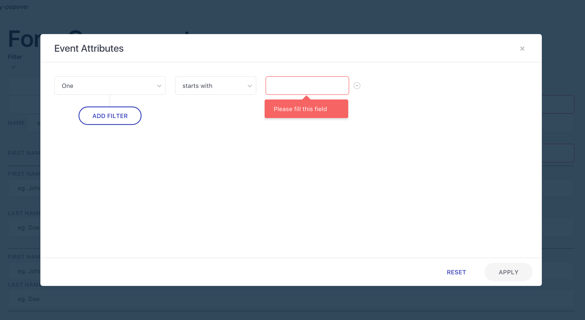

# JSON_Schema-Validation_errors

### Introduction
As an intern, I am assigned various small projects so that I have understanding of mostly all core topics pertaining to my area of interest. One of my projects was **JSON Schema Validation with Value Link integration**. At the end of completion of my project, my mentor asked me to take session on the same to make rest of my team aware of the task and logic I performed.

### JSON Schema

It is nothing but the **blueprint** of the data and its nested contents.

`Please refer the file schema.js for the demo`

After the preparation of the schema, it is validated against the prescribed constraints set in the schema. Various libraries are available for this purpose, but I used **AJV Library**. 

Thought it made most of our work easy, but we had some cases where AJV couldn’t provide solution. Hence we declared our custom validation and achieved our FIRST STEP i.e **SCHEMA VALIDATION**.

`Refer schema.js for the validation reference`

### Value-Link

This is the hero of my project; though some modification were performed here too. 

During validation, ajv generates error object which has many useful properties like 
1. datapath (where error occurred), 
1. error text (what error occured) 

Now, the fight was, to display these errors on their respective input. 
Since I had a real long data hierarchy in my project, working with it wasn’t easy. So I used a library (hosted by WebEngage on npm) named **react-valuelink**. It basically creates a **link to the path to help us reach a value in the hierarchy**. 

Refer [react-valuelink](https://www.npmjs.com/package/valuelink)

But it has some limitations, it doesn’t have support for error handling. The goal was achieved by creating methods like 
1. HandleError which returned error-message and error-boolean, 
1. Validate which performs validation,
1. RequestChangeWithValidation which changes data along with validation and 
1. Path which computes path of the current data in the tree. 

### Usage

I used it in a form where user enters the input and continuous validation of the input takes place. If the error incurred at a particular input, then a ***tooltip*** (which I created as my previous project) appears displaying the error-data. 

##### Demo

### Conclusion

In this way, the target is achieved and now, this can be easily extended to any form having any kind of inputs. Hence, our team extended this to wherever they incurred any form! 

This was all that I spoke in the session which not only helped me demonstrate my project but also made me a confident orator.

