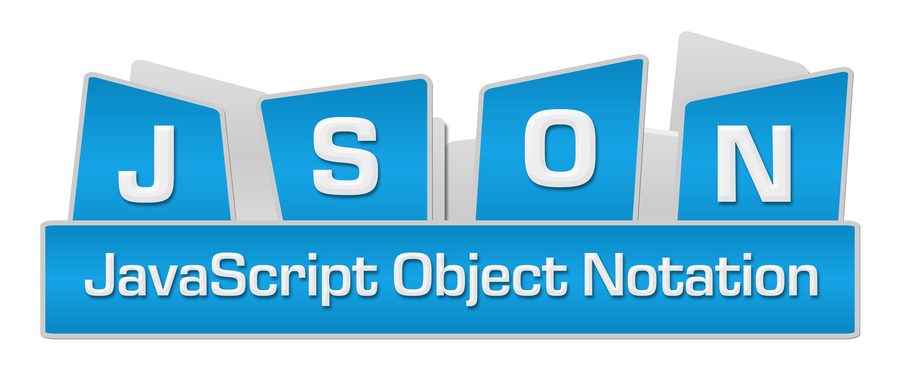

# JSON_Schema-Validation_errors

### Introduction
As an intern, I am assigned various small projects so that I have understanding of mostly all core topics pertaining to my area of interest. One of my projects was **JSON Schema Validation with Value Link integration**. At the end of completion of my project, my mentor asked me to take session on the same to make rest of my team aware of the task and logic I performed.

### JSON Schema

It is nothing but the **blueprint** of the data and its nested contents.
`Please refer the file schema.js for the demo`

After the preparation of the schema, it is validated against the prescribed constraints set in the schema. Various libraries are available for this purpose, but I used **AJV Library**. 

Thought it made most of our work easy, but we had some cases where AJV couldn’t provide solution. Hence we declared our custom validation and achieved our FIRST STEP i.e **SCHEMA VALIDATION**.
